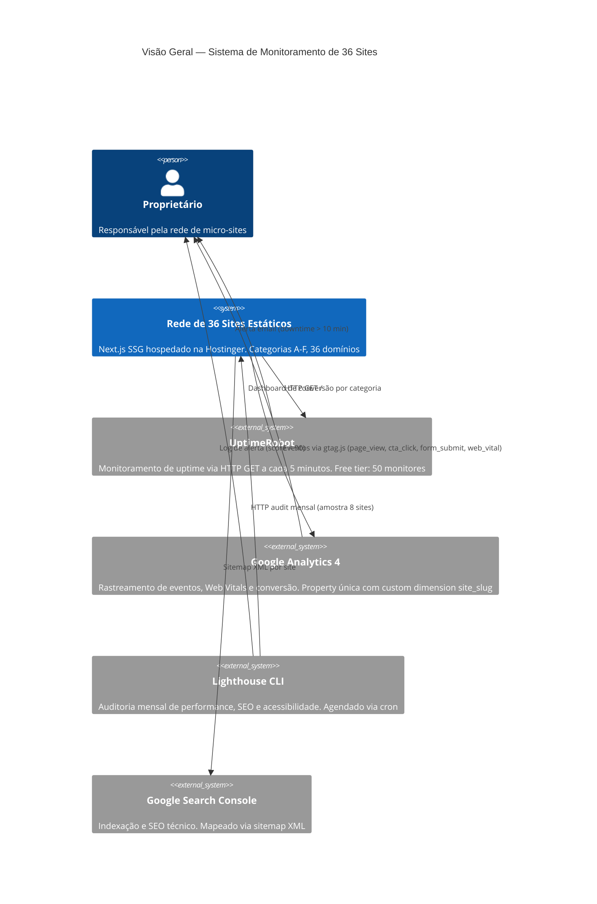
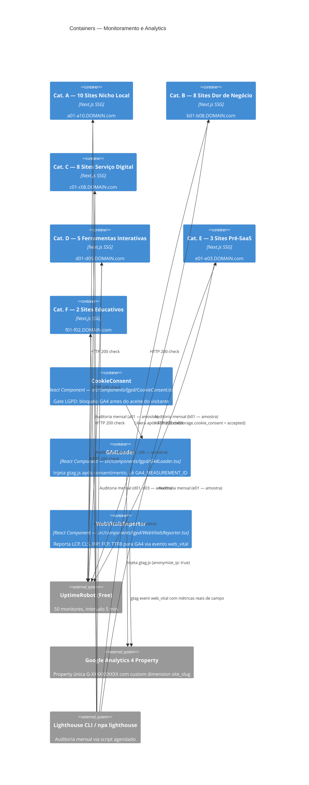

# Arquitetura de Monitoramento — Rede de 36 Sites

> Criado por: module-13-monitoramento/TASK-0/ST001  
> Guardrails: PERF-005, PERF-001, INFRA-006  
> Blueprint: `ai-forge/blueprints/monitoring-alerting.md`  
> Última atualização: 2026-04-12

---

## C4 — Level 1: System Context



---

## C4 — Level 2: Container



---

## Tabela de Responsabilidades

| Componente | Ferramenta | Frequência | Responsável | Guardrail |
|------------|-----------|-----------|-------------|-----------|
| Uptime check | UptimeRobot (free tier) | A cada 5 minutos | Automático | INFRA-006 |
| Alerta de downtime | UptimeRobot Email | Após 2 falhas consecutivas (10 min) | Automático → Proprietário | INFRA-006 |
| Auditoria performance (lab) | Lighthouse CLI | Mensal — dia 1 às 08:00 | Cron automático | PERF-005 |
| Core Web Vitals (campo) | WebVitalsReporter + GA4 | Contínuo — por page view | Automático | PERF-001 |
| Eventos de conversão | GA4 Events | Por interação do visitante | Automático | — |
| Indexação e SEO técnico | Google Search Console | Mensal (revisão manual) | Proprietário | — |

---

## Fluxos de Dados

### Fluxo 1 — Uptime Check (a cada 5 min)

```
UptimeRobot → HTTP GET https://{slug}.DOMAIN.com/
  → HTTP 200: registra "Up" no painel UptimeRobot
  → HTTP != 200 por 2 checks consecutivos (10 min):
      → Dispara email para proprietário
      → Proprietário aciona MONITORING-RUNBOOK.md § "Site Down"
```

### Fluxo 2 — Web Vitals por Page View (contínuo)

```
Visitante acessa site
  → CookieConsent renderiza banner
  → Visitante aceita → localStorage.cookie_consent = "accepted"
  → GA4Loader injeta gtag.js (anonymize_ip: true)
  → WebVitalsReporter captura: LCP, CLS, INP, FCP, TTFB
  → gtag('event', 'web_vital', { site_slug, metric_name, value, rating })
  → GA4 Dashboard → segmento por categoria (site_slug STARTS WITH {a-f})
```

### Fluxo 3 — Auditoria Lighthouse Mensal (dia 1)

```
Cron "0 8 1 * *"
  → scripts/lighthouse-monthly.sh
  → Para cada slug em SAMPLE (8 sites):
      → npx lighthouse https://{slug}.DOMAIN.com --output=json
      → Salva em docs/lighthouse/YYYY-MM/lighthouse-{slug}.json
      → Extrai performance, SEO, a11y scores
      → SE score < threshold: imprime alerta ⚠ no log
  → Relatório final com total de alertas
  → SE falhas críticas: exit 1 (visível no cron log)
```

---

## Sites Monitorados — Mapeamento por Categoria

| Categoria | Nome | Slugs | Domínios | Sites |
|-----------|------|-------|---------|-------|
| A | Nicho Local | a01–a10 | a01.DOMAIN.com … a10.DOMAIN.com | 10 |
| B | Dor de Negócio | b01–b08 | b01.DOMAIN.com … b08.DOMAIN.com | 8 |
| C | Serviço Digital | c01–c08 | c01.DOMAIN.com … c08.DOMAIN.com | 8 |
| D | Ferramenta Interativa | d01–d05 | d01.DOMAIN.com … d05.DOMAIN.com | 5 |
| E | Pré-SaaS / Waitlist | e01–e03 | e01.DOMAIN.com … e03.DOMAIN.com | 3 |
| F | Conteúdo Educativo | f01–f02 | f01.DOMAIN.com … f02.DOMAIN.com | 2 |
| **Total** | — | — | — | **36** |

> **Substituição obrigatória:** Trocar `DOMAIN.com` pelo domínio real em `config/sites-monitoring.json`  
> e nas variáveis de ambiente antes de ativar os monitores.

---

## Domínios Customizados (Edge Case)

Para sites com domínio próprio (não `.DOMAIN.com`):
- Registrar domínio exato em `config/sites-monitoring.json` → campo `domain`
- `scripts/validate-sites-health.sh` respeita `healthCheckPath` por site (default `/`)
- UptimeRobot monitora a URL exata do campo `domain`
- Anotação na coluna "Notas" de `config/SITES-REGISTRY.md`

---

## Referências

| Recurso | Path | Tipo |
|---------|------|------|
| Blueprint de monitoramento | `ai-forge/blueprints/monitoring-alerting.md` | Blueprint |
| Guardrail PERF-005 — Lighthouse CI ≥ 90 | `ai-forge/guardrails/performance/lighthouse-ci-threshold.md` | Guardrail |
| Guardrail PERF-001 — Core Web Vitals | `ai-forge/guardrails/performance/core-web-vitals.md` | Guardrail |
| Guardrail INFRA-006 — Uptime Monitoring | `ai-forge/guardrails/infrastructure/uptime-monitoring.md` | Guardrail |
| Componentes LGPD | `src/components/lgpd/` (GA4Loader, WebVitalsReporter, CookieConsent) | Código |
| Script UptimeRobot | `scripts/setup-uptime-monitors.sh` | Script |
| Script Lighthouse | `scripts/lighthouse-monthly.sh` | Script |
| Runbook operacional | `docs/MONITORING-RUNBOOK.md` | Documento |
| Registro de sites | `config/SITES-REGISTRY.md` | Configuração |
| Config centralizada | `config/sites-monitoring.json` | Configuração |

---

## Sentry (CL-028, CL-198, CL-264, CL-274, CL-477, CL-509-512, CL-561, CL-629)

### Projetos

| Projeto Sentry | Sites cobertos | Plano | Quota | Owner alerta |
|----------------|----------------|-------|-------|--------------|
| `micro-sites-cat-d` | d01-d12 (calculadoras, diagnosticos) | Free | 5k/mes | footstockbr@gmail.com |
| `micro-sites-cat-f` | f01-f06 (blogs/educativos) | Free (compartilhado opcional) | 5k/mes | footstockbr@gmail.com |
| `micro-sites-shared` | a01-c06 + scripts CLI | Free | 5k/mes | footstockbr@gmail.com |

### Tags padrao

- `site_slug` — slug canonico (`d01-calculadora-custo-site`)
- `category` — `A`-`F`
- `wave` — onda de lancamento (1-3)
- `runtime` — `browser` (default) ou `node-script` (build/CI)

### Gating LGPD

`beforeSend` em `sentry.client.config.ts` descarta evento quando `localStorage.cookie_consent !== 'accepted'`. Garante Art. 7 LGPD (consentimento explicito) e zero PII vazada via Sentry.

### Sourcemaps

Upload via `@sentry/cli` em `.github/workflows/deploy.yml` apenas para sites Cat D/F (calculadoras complexas). Removidos do `dist/` apos upload via `find dist/$SLUG -name '*.map' -delete`.

### Quota & Alertas

- Workflow `sentry-quota.yml` roda diariamente (`0 6 * * *`) chamando `scripts/sentry-quota-check.ts`
- Exit codes: 0 ok, 1 warning (>=70%), 2 critical (>=90%), 3 erro
- Em warning/critical: action `gh issue create` com label `alert,sentry`
- Alert Rule no Sentry: novas issues em `micro-sites-cat-d` com tag `component:Calculator` -> email Pedro

### Retention

- Sentry Free: 30 dias
- Sourcemaps: 90 dias automatico
- Releases: nunca expirar (necessario para reproduzir bugs antigos)

### Runbook

Rotacao de token: `docs/operations/SENTRY-ROTATION-RUNBOOK.md` (anual + sob suspeita).

### Variaveis

- ORCH (em `credentials.sentry.auth_token`): `SENTRY_AUTH_TOKEN`
- RUNTIME (em `.env.production` por site): `NEXT_PUBLIC_SENTRY_DSN`, `NEXT_PUBLIC_SENTRY_RELEASE`, `NEXT_PUBLIC_SENTRY_ENVIRONMENT`
- CI (vars): `SENTRY_ENABLED`, `SENTRY_ORG`, `SENTRY_PROJECT`, `SENTRY_QUOTA`
